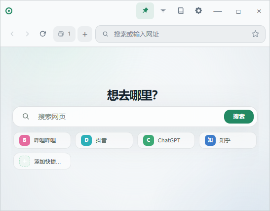
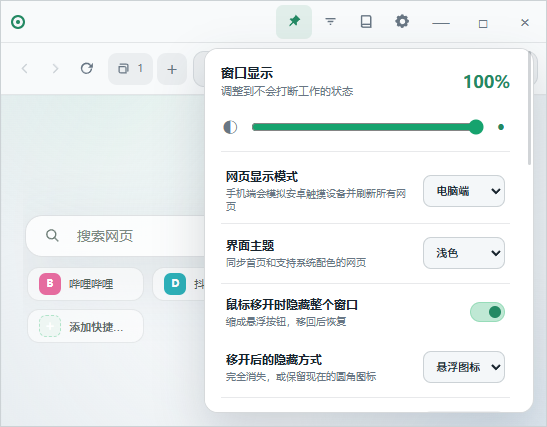
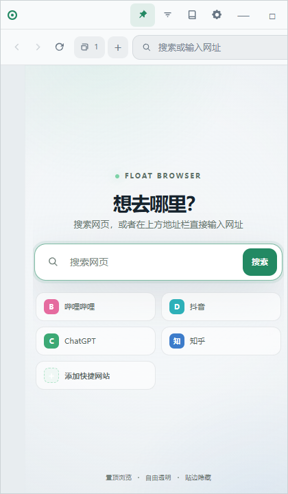
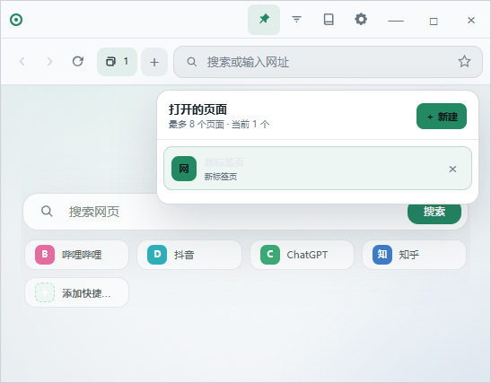

# 悬浮浏览器

一款适用于 Windows 电脑的轻量悬浮浏览器。窗口可以长期置顶显示，并支持透明度调节、鼠标移开隐藏、贴边收回、多页面浏览、手机模式、收藏、历史记录和系统托盘运行。

本仓库用于提供官方安装包、中文使用教程和软件运行所需的版本文件，不公开项目源代码。

## 界面展示

### 电脑模式主页



## 下载软件

[前往最新版下载页面](https://github.com/yliu09886-cmd/FloatBrowser-Updates/releases/latest)

进入版本页面后，在“资源”区域下载名称以 `.exe` 结尾的安装程序。普通用户不需要下载 `.blockmap`、`latest.json` 或 `latest.yml`。

当前版本：`1.15.0`

支持系统：Windows 10、Windows 11（64 位）

## 目录

- [界面展示](#界面展示)
- [软件特点](#软件特点)
- [安装方法](#安装方法)
- [快速开始](#快速开始)
- [窗口悬浮与透明度](#窗口悬浮与透明度)
- [鼠标移开隐藏](#鼠标移开隐藏)
- [贴边隐藏](#贴边隐藏)
- [电脑模式与手机模式](#电脑模式与手机模式)
- [多页面浏览](#多页面浏览)
- [收藏和历史记录](#收藏和历史记录)
- [主页快捷链接](#主页快捷链接)
- [深色与浅色模式](#深色与浅色模式)
- [系统托盘](#系统托盘)
- [常见问题](#常见问题)
- [隐私与安全](#隐私与安全)
- [问题反馈](#问题反馈)

## 软件特点

| 功能 | 说明 |
| --- | --- |
| 窗口置顶 | 浏览器可以悬浮在其他软件上方，方便随时查看网页 |
| 透明度调节 | 根据需要调整整个窗口的不透明度，最低可以调到 0 |
| 鼠标移开隐藏 | 鼠标离开窗口后自动收回，可以选择保留图标或完全隐藏 |
| 贴边隐藏 | 窗口靠近屏幕边缘后自动收回，并可调节保留显示的像素大小 |
| 多页面浏览 | 同时打开多个网页，通过页面标签快速切换 |
| 电脑与手机模式 | 可以让支持移动网页的网站按照电脑或手机布局显示 |
| 收藏网站 | 保存常用网站，方便以后快速打开 |
| 历史记录 | 查看并重新打开以前访问过的网页 |
| 自定义快捷链接 | 在主页添加自己常用的网站入口 |
| 深浅色主题 | 根据桌面环境切换深色或浅色外观 |
| 系统托盘 | 软件只在托盘区域运行，不占用任务栏位置 |

## 安装方法

1. 打开[最新版下载页面](https://github.com/yliu09886-cmd/FloatBrowser-Updates/releases/latest)。
2. 展开页面底部的“资源”区域。
3. 下载名称以 `.exe` 结尾的安装程序。
4. 双击安装程序，根据提示完成安装。
5. 安装完成后，从桌面快捷方式或开始菜单启动悬浮浏览器。

软件目前没有商业代码签名证书，Windows 首次运行时可能显示“未知发布者”。请确认安装包来自本仓库，再选择继续运行。

## 快速开始

### 打开网页

1. 点击顶部地址栏。
2. 输入网址或搜索内容。
3. 按回车键打开网页。

地址栏既可以输入完整网址，也可以直接输入要搜索的文字。

### 移动窗口

按住窗口顶部空白区域拖动，即可把浏览器移动到桌面上的任意位置。

### 调整窗口大小

把鼠标移动到窗口边缘或四个角，出现缩放指针后拖动，即可调整窗口宽度和高度。

## 窗口悬浮与透明度

### 保持窗口置顶

点击顶部的图钉按钮，可以控制浏览器是否保持在其他窗口上方。

- 图钉开启：浏览器保持悬浮置顶。
- 图钉关闭：浏览器可以被其他窗口遮挡。

### 调节透明度

1. 点击顶部的透明度按钮。
2. 拖动透明度滑块。
3. 调整到适合当前使用场景的显示效果。

透明度可以调到 0。完全透明后如果暂时找不到窗口，可以通过系统托盘图标重新显示。

### 设置面板



## 鼠标移开隐藏

在设置中开启“鼠标移开隐藏”后，鼠标离开浏览器窗口时，窗口会自动收回。

可以选择两种隐藏效果：

### 保留悬浮图标

窗口收回后保留一个小图标。把鼠标移动到图标上或点击图标，即可恢复窗口。

### 完全隐藏

窗口收回后不显示图标，可以根据设置选择恢复方式：

- 鼠标移动到窗口原来的隐藏位置后恢复。
- 在窗口原来的位置双击后恢复。

双击恢复时，窗口会在隐藏前的位置重新显示。

### 隐藏动效

设置中可以开启或关闭隐藏过渡动效：

- 开启动效：窗口平滑收回和展开。
- 关闭动效：窗口立即隐藏和恢复。

打开设置、收藏或其他功能面板时，窗口不会因为鼠标暂时离开主界面而立即收回。

## 贴边隐藏

把浏览器拖到屏幕左侧、右侧或其他支持的屏幕边缘，窗口会贴近边缘自动收回。

在设置中可以调节贴边隐藏后保留显示的像素大小：

- 数值较大：屏幕边缘保留更多可见区域。
- 数值较小：只保留较窄的触发区域。
- 设置为 0：窗口完全隐藏。

即使设置为完全隐藏，也可以把鼠标移动到对应屏幕边缘，让窗口重新显示。

## 电脑模式与手机模式

在设置中可以切换网页显示模式：

- 电脑模式：按照普通电脑浏览器方式访问网页。
- 手机模式：模拟手机浏览器访问网页，使支持移动端的网站显示手机版布局。

切换模式后，当前网页会重新加载。部分网站的显示方式由网站服务器决定，如果切换后没有变化，可以刷新网页，或者重新输入网址打开。

### 手机模式主页

<p align="center">
  
</p>

## 多页面浏览

点击页面标签区域中的加号，可以新建网页页面。

- 点击不同标签切换网页。
- 点击标签上的关闭按钮关闭当前页面。
- 每个页面可以访问不同网站。
- 在手机模式和电脑模式之间切换时，当前页面会按照新模式重新加载。

### 页面管理



## 收藏和历史记录

### 收藏网站

打开需要保存的网站后，点击收藏按钮即可加入收藏。以后可以从收藏面板快速重新打开。

### 历史记录

浏览过的网页会保存在本机历史记录中。打开历史记录面板，可以查看并重新访问以前打开过的网页。

收藏和历史记录只保存在当前电脑中，不会上传到本仓库。

## 主页快捷链接

主页支持添加自定义快捷链接：

1. 打开悬浮浏览器主页。
2. 点击添加快捷链接。
3. 填写网站名称和网址。
4. 保存后即可从主页快速打开网站。

可以根据自己的使用习惯添加多个常用网站，不受默认快捷入口数量限制。

## 深色与浅色模式

在设置中选择界面主题：

- 深色模式适合夜间或深色桌面环境。
- 浅色模式适合白天或明亮桌面环境。

切换主题只改变软件界面外观，不会删除收藏、历史记录或其他设置。

## 系统托盘

悬浮浏览器默认可以在系统托盘中运行，不占用 Windows 任务栏位置。

如果关闭主窗口后仍然能在托盘看到图标，表示软件仍在后台运行。通过托盘图标可以：

- 重新显示浏览器窗口。
- 打开相关菜单。
- 完全退出软件。

如果只关闭窗口但没有选择“退出”，软件可能仍然保留在托盘中。

## 常见问题

### 找不到浏览器窗口怎么办？

先检查 Windows 右下角的系统托盘，点击悬浮浏览器图标重新显示窗口。如果开启了完全隐藏，也可以把鼠标移动到原来的隐藏位置，或者在原位置双击。

### 鼠标移开后不想自动隐藏怎么办？

进入设置，关闭“鼠标移开隐藏”。也可以保留该功能，但关闭隐藏动效，让窗口立即收回和恢复。

### 贴边以后窗口完全看不到了怎么办？

把鼠标移动到窗口贴边前所在的屏幕边缘。如果仍然没有出现，可以从系统托盘重新显示窗口。

### 手机模式下网页仍然像电脑版怎么办？

切换到手机模式后刷新当前网页，或者关闭后重新打开。部分网站不提供移动版布局，这种情况下软件无法强制改变网站自身的页面设计。

### 为什么任务栏中没有软件图标？

这是正常设计。悬浮浏览器主要通过系统托盘运行，可以减少任务栏占用。

### Windows 提示未知发布者怎么办？

这是因为软件暂时没有商业代码签名证书。请只从本仓库的正式发布页面下载安装包，并核对文件校验值。

### 安装新版本会删除收藏和设置吗？

正常覆盖安装不会主动删除收藏、历史记录、快捷网站和窗口设置。为避免意外，不要手动删除软件的数据目录。

## 文件校验

当前 `1.15.0` 安装包的 SHA256：

```text
E290EB304BE13EFCE86CDB4C2956D3FAE2658C9AB75B13FFFB81A466673B4FB8
```

校验值不一致时，请删除安装包并从本仓库重新下载。

## 隐私与安全

- 收藏、历史记录、快捷网站和窗口设置保存在用户自己的电脑中。
- 软件检查版本时只读取本仓库公开的版本信息。
- 本仓库不会收集或上传用户的浏览记录。
- 请勿从不明网站下载别人重新打包的安装程序。


## 问题反馈

如果遇到启动、网页显示、隐藏恢复、贴边、手机模式或安装问题，可以在[问题反馈页面](https://github.com/yliu09886-cmd/FloatBrowser-Updates/issues)提交问题。

为了更快定位问题，建议同时说明：

- Windows 版本。
- 悬浮浏览器版本。
- 具体操作步骤。
- 问题出现前后的截图或录屏。

请勿在公开反馈中上传账号密码、个人聊天记录或其他敏感信息。
## 支持作者

如果你觉得悬浮浏览器不错，欢迎点个 ⭐ Star 支持一下，也可以通过下方二维码支持作者：


